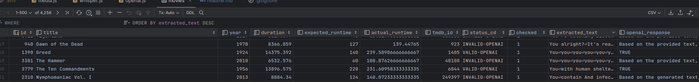

# Movie Identifier

This is a node application that will identify movies in a folder. 
Currently, it assumed all movies are in a subfolder follow a specific convention for naming. ex: `Movie Name (Year)` <br/>
It will look to identify the movie based on filename, it validates the movie based on runtime initially.
IT has a second pass validation checking if the contents of the movie text file match the movie name.

Steps: 
1. Checks movies runtime against known runtimes (TMDB API)
2. Gets the movie transcript from the movie audio file (Whisper API, running in docker)
3. Sends the movie transcript to ChatGPT (ChatGPT API)
4. Stores results in a database (Sqlite)


## Installation

This project relies on [Node.js](https://nodejs.org/) and [npm](https://www.npmjs.com/).

It used the whisper language model to determine the text of the movie. 
It then checks the movie transcript to see if it matches what the movie is about.

```bash
npm install
```

## Usage

```bash
npm run start 
```


